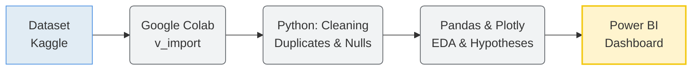

# Comprehensive-Analysis-of-Consumer-Behavior-and-Sales-Drivers-in-E-commerce
# Мета  проєкту
Провести комплексний аналіз поведінки клієнтів в e-commerce та виявити , як демографія, товари, ціни, знижки, доставка та інші фактори впливають на дохід і задоволеність клієнтів, щоб оптимізувати маркетинг, асортимент і бізнес-стратегію.
# Опис набору даних
Набір даних [Customer Shopping Trends Dataset](https://www.kaggle.com/datasets/abdallahabuelftouh/shopping-trends/data) містить 3900 записів та 19 колонок, що описують поведінку клієнтів американського інтернет-магазину. Дані охоплюють демографічні характеристики користувачів, деталі покупок, способи оплати й доставки, а також рівень задоволеності, що дозволяє аналізувати ключові фактори, які впливають на продажі та клієнтський досвід.
# Структура даних
| Колонка | Опис |
|--------|------|
| Customer ID | Унікальний ідентифікатор клієнта |
| Age | Вік клієнта |
| Gender | Стать клієнта |
| Item Purchased | Товар, придбаний клієнтом |
| Category | Категорія придбаного товару |
| Purchase Amount (USD) | Сума  в доларах США|
| Location | Локація, де було здійснено покупку |
| Size | Розмір придбаного товару |
| Color | Колір товару |
| Season | Сезон , протягом якого було здійснено покупку |
| Review Rating | оцінка, яку клієнт ставить за придбаний товар |
| Subscription Status | Наявність підписки(Так/Ні) |
| Shipping Type | Тип доставки, обраний клієнтом |
| Discount Applied | Чи була знижка |
| Promo Code Used | Чи використано промокод |
| Previous Purchases | Кількість попередніх покупок |
| Payment Method | Спосіб оплати |
| Frequency of Purchases | Частота, з якою клієнт здійснює покупки (наприклад, щотижня, раз на два тижні, щомісяця)|
# Етапи виконання проекту

## 1. Підготовка даних
   
Джерело: Дані завантажено з [Customer Shopping Trends Dataset](https://www.kaggle.com/datasets/abdallahabuelftouh/shopping-trends/data).

Середовище: Робота велася в Google Colab для забезпечення відтворюваності коду.

## 2. Очищення
Виконано перевірку на дублікати та обробку пустих значень (NaN). 
Дані приведені до потрібних типів.
   
## 3. Аналіз та візуалізація (EDA, Python)
Використано бібліотеки Pandas для маніпуляції даними та Plotly для інтерактивних графіків.
Проведено розвідувальний аналіз даних (EDA).
- Аналіз демографії
- Аналіз доходу за сегментами: стать, вік та статус підписки
- Аналіз задоволеності клієнтів

## 4. Сформульовано та перевірено гіпотези
- Вплив знижок
- Гендерні вподобання
  
## 5. Фінальний дашборд
Результати аналізу експортовано та візуалізовано в Power BI.
- Географічний аналіз (Revenue by State)
- Аналіз категорій (Revenue by Category)
- Методи оплати (Orders by Payment Methods)
- Сезонність (Sales by Season)
- Інтерактивні фільтри
# Технологічний стек
Мова програмування - Python

Аналіз даних - Pandas, NumPy

Візуалізація - Plotly Express 

BI‑інструменти - Power BI

Середовище - Google Colab

# Ключові результати та бізнес-рекомендації
На основі проведеного аналізу (EDA) та статистичних тестів було сформовано наступні висновки:

*  **Основний сегмент:** чоловіки 56–70 років формують найбільший дохід (класичний одяг, осінь)
* **Знижки неефективні:** не впливають на суму покупки чи поведінку
*  **Регіональний розрив:** лідери — Монтана, Каліфорнія; Флорида значно відстає
*  **Проблема доставки:** Next Day Air має найнижчі оцінки
*  **Слабкі продажі:** яскраві кольори верхнього одягу майже не продаються

###  Рекомендації

*  Перейти на акції від суми чека
*  Уніфікувати маркетинг для всіх клієнтів
*  Розпродати неліквідні товари
*  Провести аудит доставки
*  Оптимізувати регіональну стратегію
  
# Dashboard Power BI 
